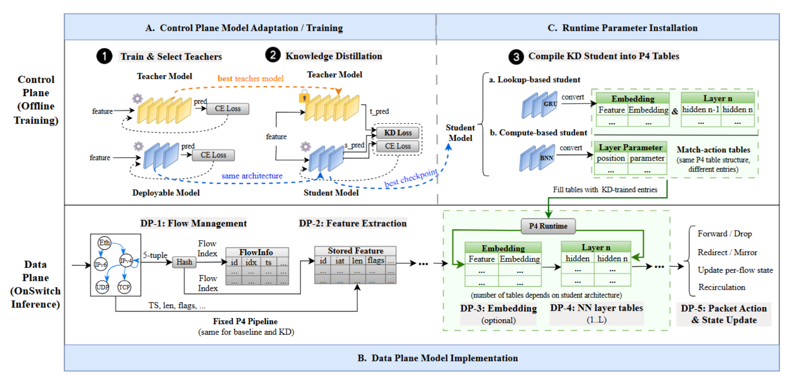

# DistillKit (Competition Release)

DistillKit is a knowledge distillation toolkit for **P4-deployable network traffic models**.  
It improves the accuracy of heavily quantized, line-rate inference models **without modifying P4 programs or data-plane inference logic**.

This repository is a **clean, competition-oriented release** for **ISCXVPN2016** and **includes the complete ISCXVPN2016 dataset**. Teacher checkpoints are **not bundled**; provide them via `--teacher-bm-path` or `DISTILLKIT_TEACHER_BM_ROOT`.

---

## Why Knowledge Distillation for P4-Deployable Models?

Programmable data planes (PDPs) enable line-rate, low-latency network traffic analysis by executing inference directly on the packet path. However, deploying deep learning models on P4 switches is fundamentally constrained by limited instruction sets, strict pipeline stages, and tight on-chip memory budgets. As a result, practical in-switch models are typically heavily compressed (e.g., binarized or low-bit quantized) and must follow fixed, feed-forward inference logic.

While prior systems mitigate quantization-induced accuracy loss using techniques such as straight-through estimators (STE), quantization-aware training (QAT), pruning, or architecture search, a substantial performance gap to full-precision models remains. A key limitation is that these compressed models are still trained primarily with one-hot hard labels, which provide sparse supervision and are often insufficient for capacity-constrained models to learn well-shaped decision boundaries.

To address this bottleneck, **DistillKit adopts an architecture-agnostic knowledge distillation approach**. During control-plane training, a high-precision software model acts as a _teacher_ and provides soft labels (logits) to guide a fixed, deployable _student_ model. By enriching supervision with inter-class similarity information, distillation complements existing STE/QAT techniques and significantly improves accuracy under extreme quantization **without changing the P4 program, inference logic, or runtime pipeline**.

> _(You may place the corresponding paper figure here to illustrate the accuracy gap under P4 constraints and the effect of distillation.)_

---

## Distillation Method

DistillKit implements a **logit-based knowledge distillation framework** based on classical teacher–student learning. The student model is optimized using a weighted combination of:

- standard supervised loss with ground-truth labels, and
    
- distillation loss that aligns the student’s logits with the teacher’s softened logits (temperature-scaled KL divergence).
    

Importantly, distillation in DistillKit is **architecture-agnostic**: it does not depend on model internals, quantization schemes, or P4-specific inference mappings. The student architecture, bit-width, and deployment footprint remain unchanged. After training, deployment simply replaces the model parameters, making distillation a _drop-in optimization layer_ for existing P4 pipelines.



---

## Distillation Effect (Accuracy Improvement)

Rather than only reporting absolute accuracy, we explicitly visualize the **performance gain introduced by knowledge distillation**.  
We report:

**ΔMF1 = MF1(distilled) − MF1(non-distilled)**

to highlight how distillation improves deployable models under fixed P4 constraints.

### Overall Performance Comparison (ISCXVPN2016, Testing Set)

|Environment|Distillation|Macro Precision|Macro Recall|Macro F1|
|---|---|---|---|---|
|P4|No|0.66|0.65|0.64|
|P4|Yes|**0.70**|**0.69**|**0.69**|
||Δ|**+0.04**|**+0.04**|**+0.05**|

Under strict P4 deployment constraints, knowledge distillation leads to **consistent improvements across precision, recall, and macro-F1**, with the most notable gains observed in **macro recall**, indicating better coverage of minority and hard-to-classify traffic classes.


---

### Per-Class F1 Improvement (ISCXVPN2016, P4)

|Class|F1 (No Distill)|F1 (Distilled)|ΔF1|
|---|---|---|---|
|Chat|0.9143|0.5833|-0.3310|
|Email|0.0000|0.2286|**+0.2286**|
|FTP|0.8932|0.9647|**+0.0715**|
|P2P|0.7576|0.7191|-0.0385|
|Streaming|0.9320|0.9271|-0.0049|
|VoIP|0.8453|0.9845|**+0.1392**|

These results show that distillation particularly benefits **hard or under-represented classes** (e.g., Email, VoIP), improving recall and overall MF1. Some classes exhibit precision–recall trade-offs, reflecting realistic behavior under strict capacity constraints.

---

## Independent Functionalities

To meet the requirements of the original open-source competition track, DistillKit independently implements the following core functionalities:

1. **Train a Teacher Model**  
    A standalone supervised training pipeline for full-precision teacher models, supporting multiple neural architectures.  
    Pretrained teacher checkpoints are optional and should be provided separately.
    
2. **Run Distillation**  
    A complete teacher–student training pipeline with configurable distillation strategies, temperature scaling, and loss weighting.  
    Distillation is performed entirely in the control plane and is decoupled from the P4 inference implementation.
    
3. **Evaluate and Analyze Models**  
   Unified evaluation and analysis utilities for teacher, student, and distilled models that  
   **emulate P4 deployment constraints** in preprocessing and inference, while also providing  
   **training-dynamics and distillation-quality diagnostics** (e.g., loss curves, gradient norms, prediction entropy, and margins).
    
4. **Export for P4 Deployment**  
    A dedicated export pipeline that converts trained student models into a P4-compatible JSON parameter format, enabling direct installation on programmable switches without modifying the P4 program or inference logic.
    

All functionalities are exposed through both a command-line interface (`distillkit`) and Python module entrypoints.

---

## What's Included

- CLI tool: `distillkit`
    
- Importable Python API
    
- **Complete ISCXVPN2016 dataset**
    
    - `dataset/ISCXVPN2016/json/statistics.json`
        
    - `dataset/ISCXVPN2016/json/train.json`
        
    - `dataset/ISCXVPN2016/json/test.json`
        
- Teacher checkpoints (provide separately; not bundled)
    
- Teacher model training pipeline
    
- Distillation training pipeline
    
- Evaluation and metrics
    
- P4 export format (JSON)
    
- Training artifact directories (`save/`, `save_kd/`, `distillation/save/`)
    
- Documentation and build scripts
    

---

## Quick Start

### 1) Install

```bash
pip install -e .
```

### 2) Show dataset statistics

```bash
distillkit stats
```

### 3) Run distillation (CLI)

```bash
distillkit distill \
  --teacher-model BiLSTMWithAttention \
  --teacher-bm-path ./teacher_bm_path
```

### 4) Evaluate a trained model

```bash
distillkit eval --model-path save_kd/.../student-best
```

Example:

```bash
distillkit eval \
  --model-path save_kd/ISCXVPN2016/T_BiLSTMWithAttention_/S_BRNN/len10_ipd8_ev6_hidden9_/kd_a0.1_t4.0_lr0.01/student-best
```

### 5) Export for P4

```bash
distillkit export --model-path save_kd/.../student-best --out export.json
```

---

## Run via Python Modules (Reference)

The following commands demonstrate that the underlying training and distillation code can be executed directly.

### Train a teacher model

```bash
python -m distillation.train_teacher \
  --dataset ISCXVPN2016 \
  --model_name BinaryRNN \
  --max_epochs 10 \
  --train_batch_size 64 \
  --lr 0.005 \
  --cuda_device_id 0
```

### Run distillation

```bash
python -m distillation.distill \
  --dataset ISCXVPN2016 \
  --teacher_model BiLSTMWithAttention \
  --teacher_ckpt_path ./teacher_bm_path/ISCXVPN2016/BiLSTMWithAttention/teacher-brnn-best \
  --kd_alpha 0.1 \
  --kd_temperature 4.0 \
  --max_epochs 10 \
  --train_batch_size 64 \
  --lr 0.005 \
  --cuda_device_id 0
```

### Evaluate and Analyze Models

```bash
python -m distillation.evaluator.evaluator \
  --baseline-dir ./distillation/save/ISCXVPN2016/BinaryRNN/len10_ipd8_ev6_hidden9_0.8_0_all_0.01 \
  --distill-dir  ./distillation/save_kd/ISCXVPN2016/BiLSTMWithAttention/studentbrnn_len10_ipd8_ev6_hidden9_0.8_0_KL_0.001_T2_a0.9 \
  --out-dir      ./distillation/save/ISCXVPN2016/compare_reports/run1
```
---

## Dataset Layout (ISCXVPN2016)

```text
dataset/
  ISCXVPN2016/
    json/
      statistics.json
      train.json
      test.json
```

Teacher checkpoints should be stored under:

```text
teacher_bm_path/
  ISCXVPN2016/
    BiLSTMWithAttention/
      teacher-brnn-best
```

---

## Build Executable (Single File)

```bash
pip install pyinstaller
powershell -ExecutionPolicy Bypass -File scripts/build_exe.ps1
```

Output:

```text
dist/distillkit.exe
```

---

## Documentation

- `docs/usage.md`
    
- `docs/api.md`
    
- `docs/architecture.md`
    
- `docs/p4_integration.md`
    

---

## Acknowledgements

This project is inspired by:

**Brain-on-Switch: Towards Advanced Intelligent Network Data Plane via NN-Driven Traffic Analysis at Line-Speed**  
Jinzhu Yan, Haotian Xu, Zhuotao Liu, Qi Li, Ke Xu, Mingwei Xu, Jianping Wu  
USENIX NSDI 2024
